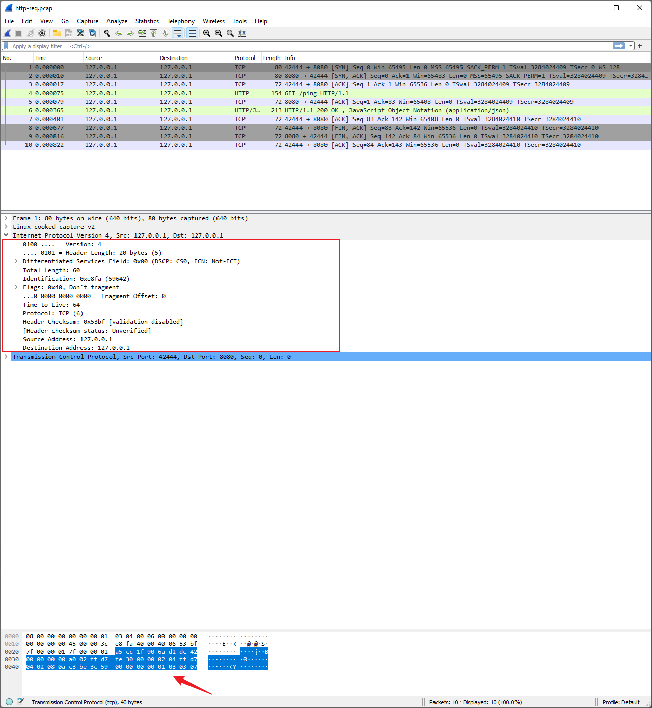

```text
Tcpdump 是一个抓取网络接口中的数据包的工具。
```

### 1. 基本网络概念

OSI七层模型：  
物理层 -> 数据链路层 -> 网络层 -> 传输层 -> 会话层 -> 表示层 -> 应用层

#### 1.1 PDU 协议数据单位

物理层：比特；

数据链路层：帧；

网络层：**数据包**，也就是tcpdump抓取的数据包；

传输层：TCP(段)/UDP(数据报)；

### 2. 基本使用

```bash
man tcpdump
```

一般可以使用 **-h** 或 **--help** 或 **man** 命令快速了解一个二进制命令工具；这里我们使用 **man** 。


```text
-c count: count 就是要抓取数据包的数量；
-i interface: interface 指定网络接口，使用 any 则抓取所有网络接口的数据包；
可通过 tcpdummp -D 列出所有网络接口；
-w file: 将抓取的数据包按一定格式写入文件；
-r file: 导入文件中保存的抓取的数据包数据；
-r/-w 使得tcpdump可以与支持文件格式(pcap, pcap-ng)的其他工具搭配使用，比如 wireshark；

-n: 不解析出address或port的名称；
-X: 打印出每个数据包的头与数据，以16进制与ascii编码的形式；

expression: 用以筛选满足条件的数据包；
```

### 3. 数据包过滤

```bash
man pcap-filter
```

tcpdump 过滤数据包表达式句法(expression syntax) 可以使用 **man cap-filter** 进行了解。


可知，一个expression由一个或多个原语(primitive)组成，而**原语**则由一个或多个前缀**修饰符**加一个id(数字或名称)组成。

修饰符有三种：

1. 类型(type): host(default), net, port
2. 方向(dir): src, dst, src or dst(default), src and dst 
3. 协议(proto): ether, fddi, tr, ip, ip6, arp, rarp, decnet, tcp, udp...

可使用 **and**, **or**, **not** 组合原语构建复杂的过滤表达式。

```bash
sudo tcpdump host 192.168.162.130
sudo tcpdump net 192.168.162.0/24
sudo tcpdump port 59695

sudo tcpdump src host 192.168.162.130
sudo tcpdump dst host 192.168.162.130
sudo tcpdump src and dst host 192.168.162.130

sudo tcpdump ip host 192.168.162.130

sudo tcpdump ip src host 192.168.162.130
```

### 4. 与wireshark搭配使用

以ping某台机器为例：

```bash
ping 14.215.177.38

sudo tcpdump -c 1 -i any dst host 14.215.177.38 -w ./ping-test.pcap
```

然后使用wireshark导入文件，即可以看到我们抓取的数据(-c 1 指定只抓取一个数据包)，随之可以使用wireshark查看数据包携带的详细数据。


### 5. 例子

#### 5.1 查看http请求中经过的IP/TCP协议头部信息

我在本地启动了一个http服务(http://127.0.0.1:8080/ping)，然后使用tcpdump抓取对此服务的请求，同时把抓取的保存到文件中供在wireshark中分析。

```bash
sudo tcpdump -n -i any host 127.0.0.1 and port 8080 -w ./http-req.pcap --print


curl http://127.0.0.1:8080/ping
```
tcpdump的输出：


wireshark的导入：


##### IP Header


Version: IP协议的版本，IPv4，设置为4；4bit

IP Header Length: IP头部长度，单位为4byte，比如值为5就是20byte；4bit

Differentiated Services Codepoint(DSCP): 区分服务优先级(等待包转发时，如何给包排列)；6bit

Explicit Congestion Notification(ECN): 拥塞通知；2bit

Size of Datagram: 单位byte，头部与数据的总大小；16bit

Identification: 和源地址一起唯一的标识这个数据包，用于分段数据报的组装；16bit

Flags: 一保留位，一不要分段位(控制路由器是否对数据报分段)，一更多段位(表明是数据包的一部分)；3bit

Fragment Offset: 单位byte，统计原发送包的大小，由执行分段的路由器设置；13bit

Time To Live: 跳转/连接数，由路由器减少，防止意外的路由循环；8bit

Protocol: 携带的数据的协议，比如：1 = ICMP; 2= IGMP; 6 = TCP; 17= UDP；8bit

Header Checksum: 头部检验和；16bit

Source Address: 源地址；32bit

Destination Address: 目标地址；32bit

Options:
通常不使用，当使用的时候，IP头长度就会超过5个32bit，也就是20byte，超过的部分就是表示options的大小；


*可以使用wireshark清楚看到头部的所有数据，且在下方以16进制与ascii编码的形式打印出。*

##### TCP Header


Source Port: 源端口；16bit

Destination Port: 目标端口；16bit

Sequence Number: 序列号；32bit

Acknowledgement Number: 确认号；32bit

TCP Data Offset: 数据长度；4bit

Reserved: 保留；3bit

Flags: 9个标记；9bit

Windows Size: 窗口大小；16bit

Checksum: 检验和；16bit

Urgent Pointer: 紧急指针；16bit

Options: 可选的tcp数据，包括特殊的确认号与窗口缩放算法；0~40byte


*可以使用wireshark清楚看到头部的所有数据，且在下方以16进制与ascii编码的形式打印出。*
